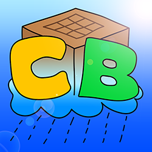

<p align="center">
  
</p>


# CraftBlock

[](https://www.curseforge.com/minecraft/modpacks/craftblock)
[](https://www.curseforge.com/minecraft/modpacks/craftblock)

The official servers are available [here at Nitrado](https://702.yt/nitradocraftblock)!

This repository contains all **override files** for the [CraftBlock](https://www.curseforge.com/minecraft/modpacks/craftblock)-modpack and also the files for the [SoManyCoolAndFunnyAdvancements](https://www.curseforge.com/minecraft/mc-mods/somanycoolandfunnyadvancements)-mod.

CraftBlock stands for Craft Attack 3 Skyblock and is an expert skyblock modpack like FTB Infinity Evolved Skyblock. That means you will have to play through many different mods, there will be way harder recipes but - this one is important - it's not too grindy.

Please see below on how to install and use the modpack to play or to develop.

## Modpack Progression

Some examples for the planed progression:

- Botania -> Astral Sorcery -> Embers
- Hearth Well + Tinkers Construct -> TC Smeltery
- Storage Drawers + OC + IE -> Refined Storage (without auto crafting) + OC Late Game -> Applied Energistics (with auto crafting, Tier 3, requires nether star)
- Immersive Engineering + Embers + OpenComputers -> _Every other tech mod_
- Unique Crops + Botania + Astral Sorcery -> _Every other magic mod_

## Installation

To play the modpack just use CurseForge version: <https://www.curseforge.com/minecraft/modpacks/craftblock>. Alternatively, you can find the release zip files also in [releases](https://github.com/sebinside/CraftBlock/releases).

This can be installed using the [CurseForge-Launcher](https://download.curseforge.com/) (bad) or [MultiMC](https://multimc.org/) (better).

In order to use the current version of the **override files** or to help in development, just clone and override the files in the modpack folder afterwards.

### Self-hosted server

#### With [Java](https://java.com) installed on host

You can find a `CraftBlock-Server-vX.Y.Z.zip` in [releases](https://github.com/sebinside/CraftBlock/releases). Extract the zip file into an empty folder.\
Execute the `startserver`-script (`.bat` on Windows / `.sh` on Unix) to set everything up and start the server on your local machine. The script will ask you to accept the EULA of Mojang.

#### With [Docker](https://docker.com)

`docker-compose.yml` (ensure to use the latest [release](https://github.com/sebinside/CraftBlock/releases) in `CF_SERVER_MOD`):

```yml
version: "3.9"

services:
  craftblock:
    container_name: craftblock

    image: itzg/minecraft-server:java8

    stdin_open: true # docker run -i
    tty: true # docker run -t

    restart: unless-stopped

    environment:
      # EULA: "TRUE"
      TYPE: "CURSEFORGE"
      CF_SERVER_MOD: "https://github.com/sebinside/CraftBlock/releases/download/v1.6.1/CraftBlock-Server-v1.6.1.zip"

    ports:
      - "25565:25565"

    volumes:
      - "./data:/data:rw"
      - "/etc/timezone:/etc/timezone:ro"
```

→ `docker-compose up`

More information on the server configuration inside Docker at <https://github.com/itzg/docker-minecraft-server>.

## List of Mods

The modpack contains the following mods:

### Big Content Mods

- [Botania](https://www.curseforge.com/minecraft/mc-mods/botania)
- [Astral Sorcery](https://www.curseforge.com/minecraft/mc-mods/astral-sorcery)
- [Unique Crops](https://www.curseforge.com/minecraft/mc-mods/unique-crops)
- [Tinkers' Construct](https://www.curseforge.com/minecraft/mc-mods/tinkers-construct)
- [Immersive Engineering](https://www.curseforge.com/minecraft/mc-mods/immersive-engineering)
- [Hearth Well](https://www.curseforge.com/minecraft/mc-mods/hearth-well)
- [Embers Rekindled](https://www.curseforge.com/minecraft/mc-mods/embers-rekindled)
- [OpenComputers](https://www.curseforge.com/minecraft/mc-mods/opencomputers)
- [Refined Storage](https://www.curseforge.com/minecraft/mc-mods/refined-storage)

### Small Content Mods

- [Extended Crafting](https://www.curseforge.com/minecraft/mc-mods/extended-crafting)
- [Storage Drawers](https://www.curseforge.com/minecraft/mc-mods/storage-drawers)
- [Storage Drawers KAPPA Addon](https://www.curseforge.com/minecraft/mc-mods/storagedrawerskappa)
- [Iron Chests](https://www.curseforge.com/minecraft/mc-mods/iron-chests)
- [OC Sensors](https://www.curseforge.com/minecraft/mc-mods/oc-sensors)
- [Pam's HarvestCraft](https://www.curseforge.com/minecraft/mc-mods/pams-harvestcraft)
- [Pam's Cookables](https://www.curseforge.com/minecraft/mc-mods/pams-cookables)
- [Cooking for Blockheads](https://www.curseforge.com/minecraft/mc-mods/cooking-for-blockheads)
- [Quark](https://www.curseforge.com/minecraft/mc-mods/quark)
- [BiblioCraft](https://www.curseforge.com/minecraft/mc-mods/bibliocraft)
- [Waystones](https://www.curseforge.com/minecraft/mc-mods/waystones)
- [Akashic Tome](https://www.curseforge.com/minecraft/mc-mods/akashic-tome)
- [Hats](https://www.curseforge.com/minecraft/mc-mods/hats)
- [Hat Stand](https://www.curseforge.com/minecraft/mc-mods/hat-stand)
- [Morph-o-Tool](https://www.curseforge.com/minecraft/mc-mods/morph-o-tool)
- [GraveStone Mod](https://www.curseforge.com/minecraft/mc-mods/gravestone-mod)

### Utility Mods

- [Botania: Garden of Glass](https://www.curseforge.com/minecraft/mc-mods/botania-garden-of-glass)
- [CraftTweaker](https://www.curseforge.com/minecraft/mc-mods/crafttweaker)
- [ModTweaker](https://www.curseforge.com/minecraft/mc-mods/modtweaker)
- [ContentTweaker](https://www.curseforge.com/minecraft/mc-mods/contenttweaker)
- [Dropt](https://www.curseforge.com/minecraft/mc-mods/dropt)
- [MoreTweaker](https://www.curseforge.com/minecraft/mc-mods/moretweaker)
- [KleeSlabs](https://www.curseforge.com/minecraft/mc-mods/kleeslabs)
- [The One Probe](https://www.curseforge.com/minecraft/mc-mods/the-one-probe)
- [BetterFps](https://www.curseforge.com/minecraft/mc-mods/betterfps)
- [Blur](https://www.curseforge.com/minecraft/mc-mods/blur)
- [Fast Leaf Decay](https://www.curseforge.com/minecraft/mc-mods/fast-leaf-decay)
- [FTB Library](https://www.curseforge.com/minecraft/mc-mods/ftb-library)
- [FTB Utilities](https://www.curseforge.com/minecraft/mc-mods/ftb-utilities)
- [Just Enough Items (JEI)](https://www.curseforge.com/minecraft/mc-mods/jei)
- [Just Enough Resources (JER)](https://www.curseforge.com/minecraft/mc-mods/just-enough-resources-jer)
- [Just Enough HarvestCraft (JEHC)](https://www.curseforge.com/minecraft/mc-mods/just-enough-harvestcraft)
- [More Overlays](https://www.curseforge.com/minecraft/mc-mods/more-overlays)
- [Mouse Tweaks](https://www.curseforge.com/minecraft/mc-mods/mouse-tweaks)
- [ReAuth](https://www.curseforge.com/minecraft/mc-mods/reauth)
- [AppleSkin](https://www.curseforge.com/minecraft/mc-mods/appleskin)
- [Controlling](https://www.curseforge.com/minecraft/mc-mods/controlling)
- [Ding](https://www.curseforge.com/minecraft/mc-mods/ding)
- [Inventory Tweaks](https://www.curseforge.com/minecraft/mc-mods/inventory-tweaks)
- [JAOPCA](https://www.curseforge.com/minecraft/mc-mods/jaopca)
- [Initial Inventory](https://www.curseforge.com/minecraft/mc-mods/initial-inventory)
- [SoManyCoolAndFunnyAdvancements](https://www.curseforge.com/minecraft/mc-mods/somanycoolandfunnyadvancements)

### Options for future mods to be included in the modpack

- [Actually Additions](https://www.curseforge.com/minecraft/mc-mods/actually-additions)
- [AIOT Botania](https://www.curseforge.com/minecraft/mc-mods/aiot-botania)
- [Ender IO](https://www.curseforge.com/minecraft/mc-mods/ender-io)
- [AE2 Stuff](https://www.curseforge.com/minecraft/mc-mods/ae2-stuff)
- [Applied Energistics 2](https://www.curseforge.com/minecraft/mc-mods/applied-energistics-2)
- [DecoCraft](https://www.curseforge.com/minecraft/mc-mods/decocraft)
- [EvilCraft](https://www.curseforge.com/minecraft/mc-mods/evilcraft)
- [Extra Utilities](https://www.curseforge.com/minecraft/mc-mods/extra-utilities), [Angel Ring To Bauble](https://www.curseforge.com/minecraft/mc-mods/angel-ring-to-bauble)
- [Flux Networks](https://www.curseforge.com/minecraft/mc-mods/flux-networks)
- [Mekanism](https://www.curseforge.com/minecraft/mc-mods/mekanism)
- [Mekanism Generators](https://www.curseforge.com/minecraft/mc-mods/mekanism-generators)
- [Mekanism Tools](https://www.curseforge.com/minecraft/mc-mods/mekanism-tools)
- [OpenBlocks](https://www.curseforge.com/minecraft/mc-mods/openblocks)
- [Thaumcraft](https://www.curseforge.com/minecraft/mc-mods/thaumcraft)
- [Thermal Dynamics](https://www.curseforge.com/minecraft/mc-mods/thermal-dynamics)
- [Thermal Expansion](https://www.curseforge.com/minecraft/mc-mods/thermal-expansion)
- [Thermal Foundation](https://www.curseforge.com/minecraft/mc-mods/thermal-foundation)
- [Wireless Crafting Terminal](https://www.curseforge.com/minecraft/mc-mods/wireless-crafting-terminal)
- [Extended Crafting](https://www.curseforge.com/minecraft/mc-mods/extended-crafting)
- [Enviromental Tech](https://www.curseforge.com/minecraft/mc-mods/environmental-tech)
- [Calculator](https://www.curseforge.com/minecraft/mc-mods/calculator)
- [Cyclic](https://www.curseforge.com/minecraft/mc-mods/cyclic)
- [Ender Utilities](https://www.curseforge.com/minecraft/mc-mods/ender-utilities)
- [Ender Storage](https://www.curseforge.com/minecraft/mc-mods/ender-storage-1-8)
- [Extreme Reactors](https://www.curseforge.com/minecraft/mc-mods/extreme-reactors)
- [Industrial Foregoing](https://www.curseforge.com/minecraft/mc-mods/industrial-foregoing)
- [Mystical Agriculture](https://www.curseforge.com/minecraft/mc-mods/mystical-agriculture)
- [Reliquary](https://www.curseforge.com/minecraft/mc-mods/reliquary-v1-3)
- [Roots](https://www.curseforge.com/minecraft/mc-mods/roots)
- [Simply Jetpacks 2](https://www.curseforge.com/minecraft/mc-mods/simply-jetpacks-2)
- [Solar Flux Reborn](https://www.curseforge.com/minecraft/mc-mods/solar-flux-reborn)
- [Tech Reborn](https://www.curseforge.com/minecraft/mc-mods/techreborn)
- [Wizardry](https://www.curseforge.com/minecraft/mc-mods/wizardry-mod)
- [Deep Mob Learning](https://www.curseforge.com/minecraft/mc-mods/deep-mob-learning)
- [Woot](https://www.curseforge.com/minecraft/mc-mods/woot)
- [XNet](https://www.curseforge.com/minecraft/mc-mods/xnet)
- [OC Sensors](https://www.curseforge.com/minecraft/mc-mods/oc-sensors)
- [BedrockCraft](https://www.curseforge.com/minecraft/mc-mods/bedrockcraft)
